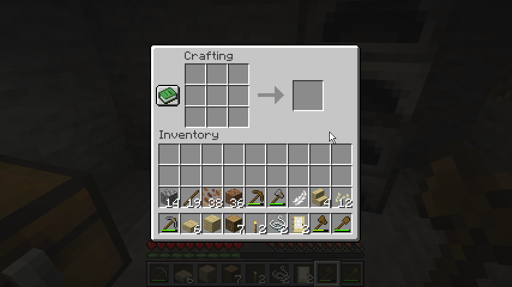
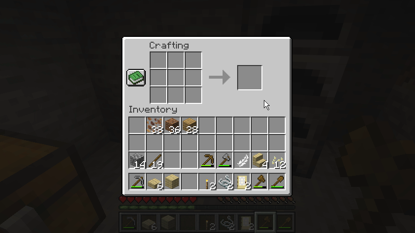
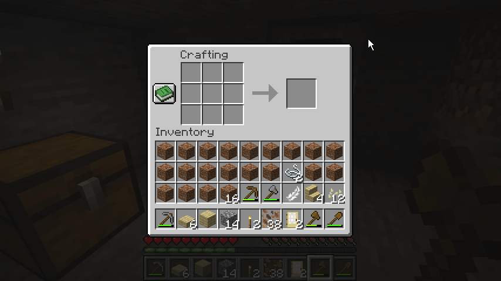
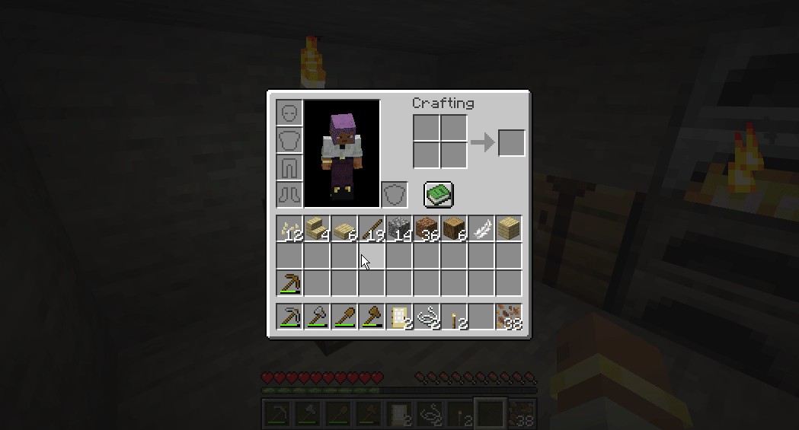
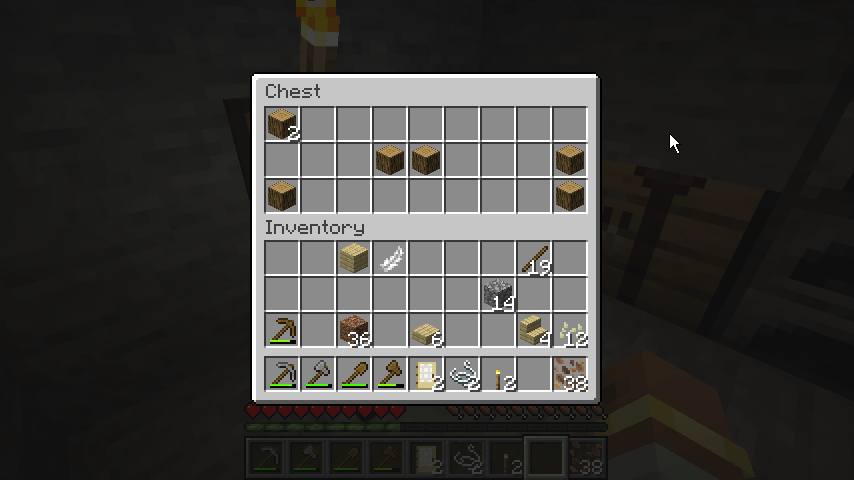
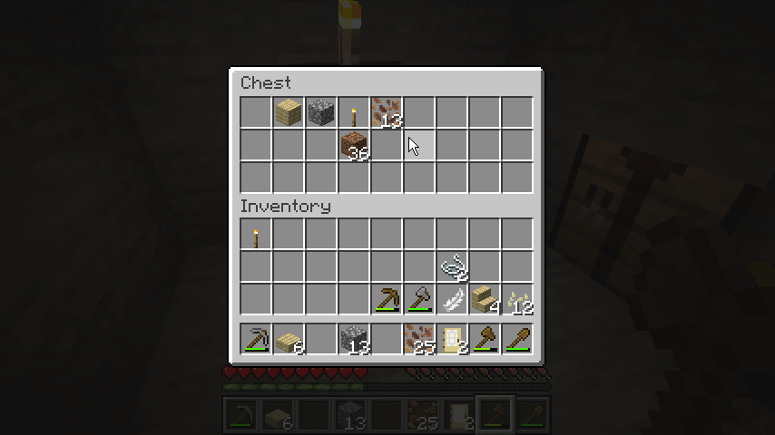

master  dev 

#  Features
==========
This mod currently focuses on mouse/item interaction quality-of-life in inventory and crafting screens.

All options can be toggled on/off via in-game mod config menu, or root Minecraft directory config file
  `Esc > Mods > Auxilio config`
  `minecraft_root/config/auxilio-common.toml`

## Middle click sort in crafting grid:
 #### Middle click on any crafting slot (2x2 or 3x3) and it will sort the grid.
     
  Single-item-type grids are spread as evenly as possible across all valid crafting slots.
    

    
  Mixed-item grids use type-local balancing: each type is equalized within the slots that already contain that type.
	


## Shift + double left-click bulk transfer:

  Shift + double left-click on a player-inventory slot quick-moves all matching items from player inventory into the currently open container (for example chest or crafting table inventory), as allowed by slot rules.



## Shift + drag quick move:

  Hold Shift and drag left-click across slots to quick-move hovered stacks. Each hovered slot is clicked at most once per drag stroke to avoid repeated click spam.
    


## Scroll transfer:

  Scroll up: move 1 item from hovered slot toward the opposite inventory side.
  Scroll down: move 1 item from hovered non-player slot into player inventory.



## Repeat right-drag:

Config option: `enableRepeatRightDrag` (default `true`).
When enabled, RMB drag replaces vanilla drag behavior.
Re-entering a slot during the same drag places another item there.



## Debug logging:
  - Config option: `debugMouseTweaks`.
  - When enabled, detailed mouse tweak traces are logged with `[MouseTweaks]` in `run/logs/latest.log`.

```
[15:52:22] [FileWatcher-1-thread-1/DEBUG] [ne.ne.fm.co.ConfigWatcher/CONFIG]: Config file auxilio-common.toml changed, re-loading
[15:52:25] [Render thread/INFO] [co.ja.au.Auxilio/]: [MouseTweaks] scrollUp moved one item from slot 30 to slot 0
[15:52:25] [Render thread/INFO] [co.ja.au.Auxilio/]: [MouseTweaks] scrollUp moved one item from slot 30 to slot 0
[15:52:25] [Render thread/INFO] [co.ja.au.Auxilio/]: [MouseTweaks] scrollUp moved one item from slot 30 to slot 0
[15:52:25] [Render thread/INFO] [co.ja.au.Auxilio/]: [MouseTweaks] scrollUp moved one item from slot 30 to slot 0
```

# Release Checklist
==========
- Bump version in `settings.gradle` (`ext.release_version`).
- Keep `gradle.properties` `mod_version` aligned with the same value.
- Commit and tag (for example `v1.0.0`).
- Create a GitHub Release from that tag.
- The `Release Jar` workflow will build and attach `build/jar/*.jar` to the release.

# Additional Resources:
==========
Community Documentation: https://docs.neoforged.net/  
NeoForged Discord: https://discord.neoforged.net/
